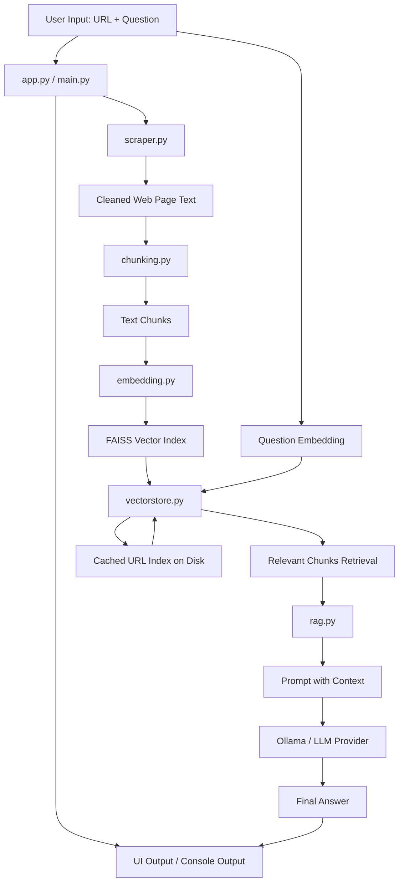

# Design Document: Website-Aware Web Agent

## 1. Overview

This project is a lightweight Retrieval-Augmented Generation (RAG) system designed to answer questions about a specific website. The system does the following:

1. Scrapes content from a given web page.
2. Cleans and chunks the text.
3. Converts the chunks into embeddings.
4. Stores those embeddings in a FAISS vector index.
5. Retrieves the most relevant chunks for a user question.
6. Sends the retrieved context to a language model for answer generation.

The project is built to run locally and is especially useful for website-specific Q&A and document-grounded chat.

---

## 2. Goals

- Answer questions using website content as the source of truth.
- Avoid hardcoding page-specific data into the model.
- Cache index data per URL to reduce repeated work.
- Support both CLI and Streamlit-based interfaces.
- Keep the architecture simple, modular, and easy to extend.

---

## 3. High-Level Architecture

The application follows a classic RAG pipeline:

- Input URL and question
- Web page retrieval and extraction
- Text cleaning and segmentation
- Embeddings generation
- Vector indexing and retrieval
- Prompt construction
- LLM response generation

The flow is similar to:

User Query -> Search / Retrieval -> Prompt with Context -> LLM -> Final Answer

The main modules coordinate around this pipeline and each file has a distinct responsibility.

### 3.1 Formal Architecture Diagram

This diagram illustrates the end-to-end architectural flow of the system, showing how website content is scraped, transformed, indexed, retrieved, and then passed to the model for answer generation.

---

## 4. File-by-File Design

### 4.1 app.py

Purpose:
This is the main Streamlit user interface for the application.

Responsibilities:
- Accepts a website URL and a user question from the browser.
- Validates inputs.
- Scrapes the target page.
- Checks whether a valid index for the URL already exists.
- Builds or refreshes the index if the page content has changed.
- Loads indexed chunks.
- Searches the FAISS index for the most relevant content.
- Builds a prompt with retrieved context.
- Calls the local LLM model and displays the answer in the UI.

Design notes:
- This file acts as the interactive front end of the system.
- It orchestrates the entire user interaction flow.
- It displays retrieved chunks in an expandable panel for transparency.

Key functions used:
- `scrape()` from scraper.py
- `chunk_text()` from chunking.py
- `build_and_save()` from vectorstore.py
- `load_index_and_texts()` from vectorstore.py
- `search()` from vectorstore.py
- `built_prompt()` and `call_ollama()` from rag.py

---

### 4.2 main.py

Purpose:
This is a command-line version of the website Q&A workflow.

Responsibilities:
- Prompts the user to enter a URL and a question.
- Checks if an index already exists for the URL.
- If not, it scrapes, chunks, and builds the index.
- Loads the index and texts.
- Embeds the query.
- Searches the FAISS index.
- Builds a context-based prompt.
- Sends the prompt to Ollama and prints the answer.

Design notes:
- This file is a simpler, non-UI execution path.
- It emphasizes pipeline execution in a direct command-line manner.
- It is useful for testing the internal logic without the Streamlit frontend.

Key functions used:
- `index_exists()`, `load_index_and_texts()`, `build_and_save()` from vectorstore.py
- `scrape()` from scraper.py
- `chunk_text()` from chunking.py
- `embed_text()` from embedding.py
- `built_prompt()` and `call_ollama()` from rag.py

---

### 4.3 scraper.py

Purpose:
Responsible for fetching and cleaning webpage content.

Responsibilities:
- Uses `requests` to load a page from a URL.
- Raises a clear error if the page cannot be fetched.
- Parses HTML using BeautifulSoup.
- Removes noise such as:
  - scripts
  - styles
  - header
  - footer
  - nav
  - aside
- Extracts readable text with `get_text()`.
- Returns clean text that is suitable for chunking and embedding.

Design notes:
- This file is the data acquisition component of the pipeline.
- The quality of the scraped text directly affects retrieval quality and answer accuracy.
- It converts raw HTML into a plain-text corpus used downstream.

Important function:
- `scrape(url)`

---

### 4.4 chunking.py

Purpose:
Breaks the scraped page text into smaller, manageable units for retrieval.

Responsibilities:
- Splits text into paragraphs using double newlines.
- Handles paragraphs larger than the target chunk size.
- Creates chunks with a configurable size and overlap.
- Preserves relevant context across chunks through overlap.
- Returns a list of text chunks.

Design notes:
- Chunking is critical in RAG systems because retrieval quality depends on chunk granularity.
- Overlapping chunks help preserve continuity across paragraph boundaries.
- This module balances chunk length against content coverage.

Important function:
- `chunk_text(text, chunk_size=1000, chunk_overlap=100)`

---

### 4.5 embedding.py

Purpose:
Converts text chunks and queries into vector embeddings.

Responsibilities:
- Loads the `all-MiniLM-L6-v2` sentence-transformer model.
- Encodes one or many text strings into embeddings.
- Returns the embedding vector(s) as a NumPy array.

Design notes:
- This is the semantic representation layer of the application.
- The model converts words and phrases into vectors where similar meaning is represented by nearby values.
- The same embedding model is used for both document chunks and the user's question.

Important function:
- `embed_text(texts)`

---

### 4.6 vectorstore.py

Purpose:
Stores and retrieves text embeddings using FAISS and caches them by URL.

Responsibilities:
- Converts a URL into a stable file identifier.
- Hashes page content to detect whether the page content changed.
- Builds and saves a FAISS index and text list to disk.
- Loads saved index and stored texts.
- Checks whether an index exists and whether it is still valid.
- Searches the vector store for semantically relevant chunks.

Key design elements:
- `url_to_id(url)`: produces a safe filesystem identifier.
- `content_hash(text)`: creates a deterministic version of page content.
- `_paths_for(url)`: manages the generated file paths.
- `build_and_save(url, chunks, page_text=None)`: creates embeddings and saves the index.
- `load_index_and_texts(url)`: loads the cached FAISS index and texts.
- `index_exists(url, current_text=None)`: checks for valid cached data.
- `search(index, texts, question, k=8)`: returns the top matching chunks.

Design notes:
- This module is the persistent memory of the agent.
- It ensures the system does not rebuild the index every time for the same page.
- It also detects stale content and rebuilds the vector store automatically.

---

### 4.7 rag.py

Purpose:
Builds retrieval prompts and calls the local LLM.

Responsibilities:
- Takes the user question and relevant chunks.
- Joins chunks into a contextual string.
- Sends a prompt to Ollama using a local HTTP API call.
- Returns the generated answer.

Important functions:
- `call_ollama(prompt, model="llama3.2")`
- `built_prompt(question, chunks)`

Design notes:
- This module is the bridge between retrieval and generation.
- It synthesizes the model prompt by injecting the retrieved context into a fixed instruction template.
- The system behavior is grounded in the retrieved website content rather than in the model’s general memory alone.

---

### 4.8 llm.py

Purpose:
Alternative LLM integration through Groq/OpenAI-compatible API.

Responsibilities:
- Loads environment variables using `dotenv`.
- Connects to a Groq-based OpenAI-compatible endpoint.
- Calls a model with a user prompt and returns the generated response.

Design notes:
- This is optional and complementary to the default Ollama-based flow.
- It enables integration with hosted LLM providers when needed.
- It is not the primary path in the current design, since `rag.py` uses Ollama directly.

Important function:
- `call_groq(prompt, model="openai/gpt-oss-20b")`

---

### 4.9 requirements.txt

Purpose:
Lists the Python packages required to run the project.

Included packages:
- streamlit
- requests
- beautifulsoup4
- sentence-transformers
- faiss-cpu
- numpy
- openai
- python-dotenv
- ollama
- torchvision

Design notes:
- This is the dependency manifest for the project.
- It ensures the environment can install the exact libraries needed for scraping, embedding, vector search, and LLM access.

---

## 5. End-to-End Data Flow

1. The user enters a website URL and a question.
2. The application scrapes the page content.
3. The text is cleaned to remove non-content HTML structures.
4. The cleaned text is split into chunks.
5. Each chunk is embedded into a vector.
6. The vectors are stored in a FAISS index.
7. The question is embedded as well.
8. Similar chunks are retrieved using nearest-neighbor search.
9. The retrieved chunks are added to a prompt.
10. The LLM generates an answer grounded in that context.
11. The answer is displayed to the user.

---

## 6. Key Design Patterns

### 6.1 Modular Pipeline
Each stage of the system is separate:
- scraping
- chunking
- embedding
- indexing
- retrieval
- generation

This keeps responsibilities distinct and makes the project easier to maintain.

### 6.2 Local-first Design
The project is designed to work with local runtime dependencies, especially Ollama and sentence-transformer models.

### 6.3 Caching
The vectorstore caches indexes per URL and checks whether page content has changed before reusing data.

### 6.4 Retrieval Grounded Generation
The answer is generated from retrieved context instead of plain model memory alone.

---

## 7. Strengths of the Current Design

- Clear separation of concerns
- Easy to follow execution flow
- Modular so each component can be improved independently
- Suitable for website-specific knowledge retrieval
- Minimal dependencies and simple runtime model

---

## 8. Possible Improvements

- Add explicit logging and diagnostics.
- Add unit tests for scraping, chunking, and retrieval.
- Support more robust URL validation and anti-bot handling.
- Add multi-page or multi-URL indexing.
- Add asynchronous processing for large websites.
- Improve prompt templates for better answer quality.
- Add model selection configuration for different LLMs.

---

## 9. Short Project Summary:

The Website-Aware Web Agent is a lightweight Retrieval-Augmented Generation application that answers questions based on the content of a specific website. It scrapes a target page, cleans and chunks the extracted text, embeds the content using a sentence-transformer model, stores the vectors in a FAISS database, and retrieves the most relevant passages for a user question. The retrieved context is then passed to a local LLM, such as Ollama, to generate a grounded answer. The project demonstrates a practical RAG workflow using web data, semantic search, and local model inference in a modular and extensible design.

This project implements a simple yet effective website-aware RAG system. The design is centered around a clear pipeline that transforms raw website text into searchable semantic representations and then uses those retrieved chunks to answer user questions with a language model.

The architecture is intentionally modular, making it straightforward to extend, debug, and adapt for different websites, document sources, or LLM providers.
